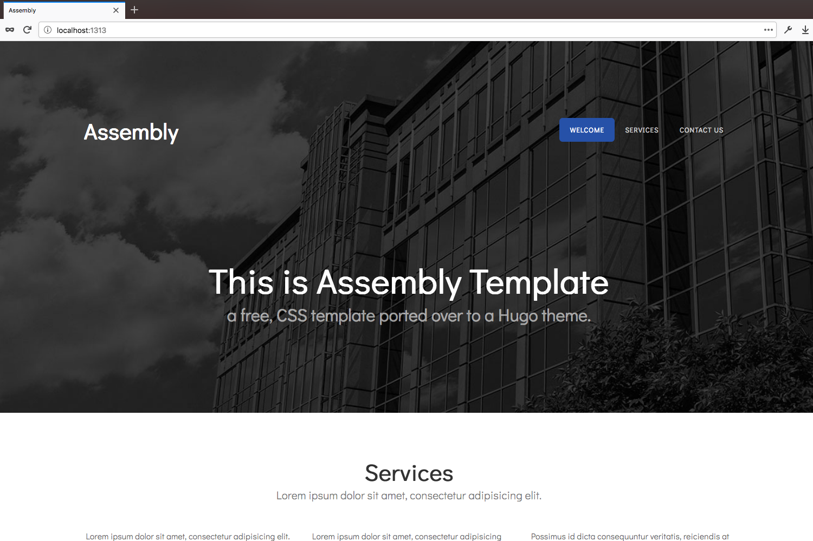

# Assembly Theme



This theme is a Hugo port of the assembly theme by [http://templated.co](http://templated.co). A two-column, fixed-width design with dark color scheme.

---

[](https://waffle.io/salsysd/hugo-assembly)

## Installation

Follow the themes guide on the [Hugo website](https://gohugo.io/themes/installing-and-using-themes/). Briefly, within your Hugo folder:

```sh
$ cd themes
$ git clone https://github.com/salsysd/hugo-assembly.git
```

## Getting started

### The config file
Take a look inside the `exampleSite` folder of this theme. You’ll find a file called `config.toml`. To use it, copy the `config.toml` in the root folder of your Hugo site. Feel free to change the strings in this theme.

Add `theme = "hugo-assembly"` to this config or when starting the service, use `hugo server -t hugo-assembly`.


## Credits

Credit for this theme goes to [http://templated.co](http://templated.co), which is licensed under a [CC BY 3.0](https://creativecommons.org/licenses/by/3.0/) license. If you use this Hugo port, please consider the terms of that license and make proper attribution to [http://templated.co](http://templated.co).

## Changelog

- The initial port by @salsysd is [here](changelog.md); if you fork this theme and make changes, please list them in the changelog.

- fixed minor issues for the hugo theme build script
